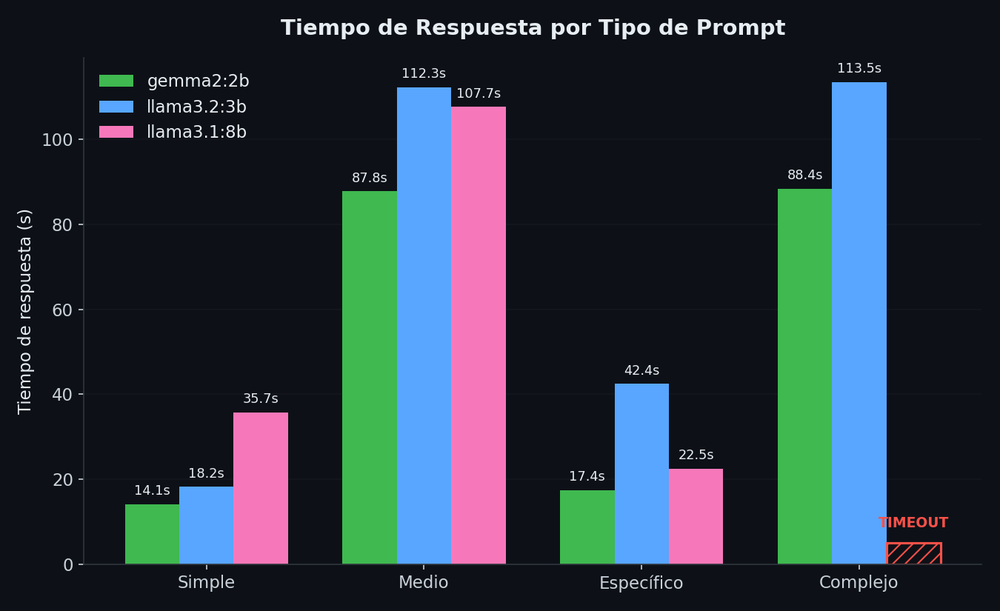
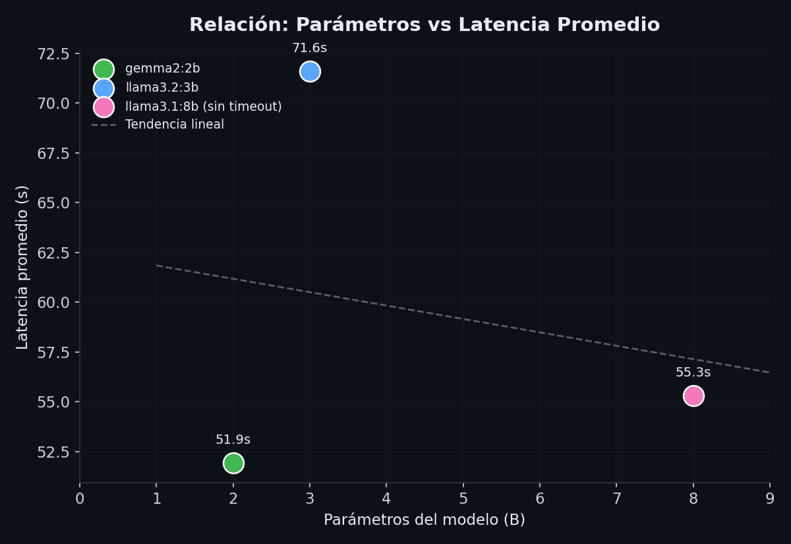

# Cliente de Chat para Ollama (`mi_chat_llm`)

Aplicación de escritorio desarrollada en **Python** con **Tkinter** que actúa como cliente gráfico para interactuar con modelos de lenguaje locales (LLMs) gestionados mediante la API de **Ollama** (`http://localhost:11434/api/generate`).

---

## 📁 Estructura del Proyecto

```text
mi_chat_llm/
├── app/
│   ├── __init__.py        # Módulo ejecutable Python
│   ├── llm_client.py      # Cliente HTTP aislado para Ollama API y medición de tiempo
│   └── ui.py              # Interfaz gráfica Tkinter, eventos y control de hilos
├── main.py                # Punto de entrada de la aplicación
├── requirements.txt       # Dependencias externas (únicamente requests)
├── README.md              # Documentación e instrucciones completas
└── ANALISIS.md            # Registro comparativo de tiempos de respuesta por modelo
```

---

## 🌟 Características y Buenas Prácticas

1. **Baja dependencia externa**:
   - Diseñado utilizando **Tkinter** (incluido en la biblioteca estándar de Python) y la librería HTTP **`requests`** como única dependencia externa.
2. **Alta cohesión y separación de responsabilidades**:
   - `app/llm_client.py`: Maneja la comunicación en red con el servidor local de Ollama, el formato de peticiones JSON y el cálculo del tiempo de respuesta en segundos.
   - `app/ui.py`: Maneja la presentación visual, la captura de interacción del usuario y la actualización del historial.
   - `main.py`: Punto de entrada limpio que inicializa y lanza el bucle principal (`mainloop`).
3. **Manejo de hilos asíncronos (`threading`)**:
   - La consulta al LLM se procesa en un hilo secundario en segundo plano, evitando que la ventana de la interfaz Tkinter se congele mientras el modelo genera la respuesta.
4. **Medición de tiempo por mensaje**:
   - Calcula con precisión (`time.perf_counter()`) la latencia en segundos empleada por el modelo para retornar la respuesta (`⏱️ [1.45s]`).
5. **Selector de modelos dinámico**:
   - Menú desplegable para seleccionar entre los modelos: `gemma2:2b`, `llama3.2:3b` y `llama3.1:8b`.
6. **Controles adicionales**:
   - Limpieza completa del historial de chat.
   - Envío rápido mediante la tecla **Enter** (y soporte para saltos de línea con **Shift + Enter**).

---

## 🛠️ Requisitos Previos

1. **Python 3.8 o superior** instalado en el sistema.
2. **Ollama** instalado y ejecutándose localmente en el puerto predeterminado (`http://localhost:11434`).
3. Modelos requeridos descargados en Ollama.

---

## 🚀 Guía de Instalación y Uso

### 1. Clonar o descargar el proyecto
Ubícate en la carpeta raíz del proyecto `mi_chat_llm`:
```bash
cd mi_chat_llm

git clone https://github.com/SantiagoMenacaP/chat-llm-local.git
```

### 2. Instalar dependencias
Instala la única dependencia externa utilizando `pip`:
```bash
pip install -r requirements.txt
```

### 3. Descargar los modelos en Ollama
Asegúrate de que el servicio de Ollama se encuentre iniciado y ejecuta los siguientes comandos en tu terminal para descargar los modelos soportados:

```bash
ollama pull gemma2:2b
ollama pull llama3.2:3b
ollama pull llama3.1:8b
```

> **Nota:** Si algún modelo no está descargado, la aplicación te mostrará un mensaje de error HTTP descriptivo al intentar hacer una consulta con dicho modelo.

### 4. Ejecutar la Aplicación
Lanza la interfaz del chat ejecutando:

```bash
python main.py
```

---

## 📊 Medición y Análisis de Rendimiento

Puedes utilizar el archivo [`ANALISIS.md`](ANALISIS.md) para registrar y comparar los tiempos de respuesta obtenidos con distintos prompts entre los tres modelos (`gemma2:2b`, `llama3.2:3b`, `llama3.1:8b`).

### Gráficas de Rendimiento




